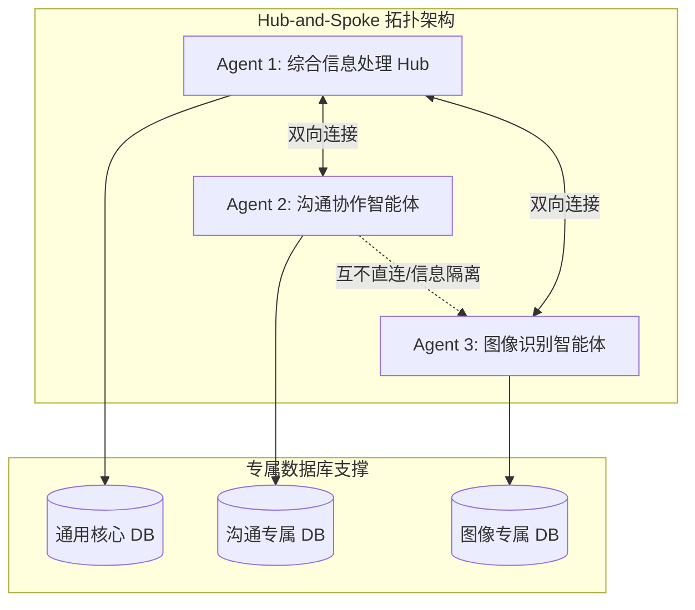

# 悦排 · 智能病例调度工作台 (YuePai / CasePilot)

> **领健悦见（LinkedCare）正畸业务线核心数智化产品**
>
> 悦排（YuePai，英文备选 CasePilot）是一款以 AI 为核心驱动的智能病例调度工作台。它致力于将隐形正畸方案设计师从“被动响应的状态机器”升级为“主动的时间管理专家”，系统性解决高并发、多状态病例调度中的效率损耗，是领健 **SaaS+X** 战略中首个可量化 ROI 的 AI 落地场景。

---

## 🧭 核心 HMW 问题与设计哲学

> [!IMPORTANT]
> **核心 HMW (How Might We) 问题：**
> 我们如何让正畸方案设计师在面对 30+ 并发、多状态病例时，**无需切换界面或进入详情页，即可在 30 秒内完成优先级判断并立即启动最紧急任务？**

### 从“状态中心”转变为“行动中心”
传统工作台围绕“病例状态”（如待处理、待修改、挂起）进行 Tab 隔离设计，迫使设计师自行跨 Tab 对比紧急度。悦排打破状态隔离，采用**统一收件箱（Active Inbox）+ 四色分区**，以“设计师的下一步行动”为核心驱动力：

| 维度 | 旧范式（状态中心） | 新范式（行动中心） |
| :--- | :--- | :--- |
| **架构组织** | 按状态分 Tab（待处理/待修改/挂起） | 按紧急度分区，所有状态统一列表页展示 |
| **决策引导** | 展示病例当前处于什么流程状态 | 展示“设计师的下一步行动是什么” |
| **任务获取** | 设计师主动切换 Tab 寻找并评估任务 | 系统基于时效及风险，自动将最紧迫任务推至首位 |
| **跳转摩擦** | 必须跳转详情页承载完整修改意见与记录 | 列表页承载决策所需的最小信息集，行内/悬停处理异常 |

---

## 📂 项目文件结构

| 文件名 | 类型 | 说明 |
| :--- | :--- | :--- |
| 📄 [README.md](file:///c:/Users/THC/Desktop/当前工作资料/个人antigravity/linkcare/README.md) | Markdown | 项目自述文件（本文档） |
| 📄 [case_workbench_PRD_v2.md](file:///c:/Users/THC/Desktop/当前工作资料/个人antigravity/linkcare/case_workbench_PRD_v2.md) | PRD 文档 | **悦排 PRD v2.1 完整版**，包含核心算法、三智能体拓扑及数据飞轮演进路径 |
| 📄 [yuepai-workbench.html](file:///c:/Users/THC/Desktop/当前工作资料/个人antigravity/linkcare/yuepai-workbench.html) | HTML | **高保真可运行交互原型**，完美呈现四色分区、Inline Drawer、AI 助手面板折叠等前端动效 |
| 📄 [yuepai-customer-journey-map.md](file:///c:/Users/THC/Desktop/当前工作资料/个人antigravity/linkcare/yuepai-customer-journey-map.md) | Markdown | 方案设计师「陈薇」的一天工作**用户体验旅程图（Customer Journey Map）**及系统摩擦点分析 |
| 📄 [yuepai-prd-ppt.html](file:///c:/Users/THC/Desktop/当前工作资料/个人antigravity/linkcare/yuepai-prd-ppt.html) | HTML | **产品评审演示 HTML 幻灯片**，双击可在浏览器中流畅播放展示 |
| 📄 [yuepai-ppt-script.md](file:///c:/Users/THC/Desktop/当前工作资料/个人antigravity/linkcare/yuepai-ppt-script.md) | Markdown | 演示幻灯片的完整讲解汇报逐字稿（共计 5,200 字，23 张 Slide） |
| 📄 [company background.txt](file:///c:/Users/THC/Desktop/当前工作资料/个人antigravity/linkcare/company%20background.txt) | Text | 领健（LinkedCare）公司战略、融资及业务重点背景参考 |
| 🖼️ [logo.png](file:///c:/Users/THC/Desktop/当前工作资料/个人antigravity/linkcare/logo.png) | Image | 悦排/领健项目 Logo 资产 |

---

## 📊 核心痛点与系统性损耗分析

经研究，方案设计师日均面临 ★30–40 件病例，平均每件耗时 ★15–20 分钟，日均被外部中断约 8 次。旧系统在流程设计上的缺陷导致人均每日产生 **约 50 分钟的系统性时间损耗**：

| 痛点场景 | 根本原因 | 行为损耗链路 | 日均损耗/人 (假设★) |
| :--- | :--- | :--- | :--- |
| **优先级判断成本高** | Tab 割裂，缺乏跨状态紧急度对比，全凭设计师经验直觉排序 | 每次登录/任务切换均需花 2–5 分钟逐个 Tab 翻看，难以确定第一顺位 | **~10 分钟** |
| **关键数据获取成本高** | 列表页字段并非围绕“行动决策”设计，退回原因与挂起物料无法直观获取 | 必须点击进入详情页 $\rightarrow$ 浏览长文 $\rightarrow$ 记录信息 $\rightarrow$ 返回列表（来回跳转摩擦） | **~20 分钟** |
| **异常修改链路过长** | 修改要求与 CAD 软件脱节，无行内对比，依赖设计师工作记忆 | 医生意见口语化难懂 $\rightarrow$ 手工记录 $\rightarrow$ 凭记忆在 CAD 中修改，**二次退回率高达 ~8%** | **~20 分钟** |
| **合计** | **系统以“状态”为中心组织界面，而非以“行动”为中心** | **月度合计损耗约 3600 人时**（200人团队） | **~50 分钟/天** |

---

## 🛠️ 三大核心解决方案规格

### 1. AI 动态优先级引擎与四色分区
系统取消传统的五 Tab 割裂架构，将所有活跃病例汇入统一 Active Inbox，并引入 **SLA 风险评分算法（Risk Score）**：

$$RiskScore = w_1 \cdot SLA_{remaining} + w_2 \cdot TaskType + w_3 \cdot CollabState + w_4 \cdot DoctorProfile$$

* **四色优先级分区规则**：
  * 🔴 **Critical（红区）**：剩余 SLA < 4h，或退回病例且剩余 SLA < 12h。**行动指引：立即处理，其余让路。**
  * 🟡 **Urgent（黄区）**：首版待做，剩余 SLA 在 4-24h 之间。**行动指引：正常推进，按序处理。**
  * 🔵 **Pending（蓝区）**：当前等待外部响应（待医生确认/待内审）。**行动指引：监控状态，一键催办。**
  * ⚪ **Paused（灰区）**：资料缺失，已暂停 SLA 挂起。**行动指引：催办后等待，不占设计负荷。**
* **区域序号徽标（Zone Sequence Badge）**：列表行首提供 `● 红1` `● 黄2` `● 蓝1` 等动态序号徽标，设计师一眼便知当前顺位。
* **顶部状态看板**：支持 30 秒自动倒计时刷新、多区域叠加筛选（如可同时勾选“红区+黄区”）。

### 2. 黄金字段矩阵与 F 型阅读路径
重新梳理列表字段，坚守“最小信息暴露”原则，仅保留能够回答 **“这个病例有多紧急”** 或 **“这个病例有多难设计”** 的黄金字段：

```
← 核心扫描区（左侧第一眼）                                             行内辅助与操作（右侧按需） →
[四色胶囊徽标] [病例ID] ── [患者信息 + AI难度标签] ── [门诊/医生星级] ── [SLA精确倒计时] ── [行内状态摘要] ── [动态主操作]
```

* **AI 难度特征标签**：行内常显由 AI 自动解析的标签（如 `#拔牙` 红色高难、`#骨性三类` 橙色中难、`#强支抗`），帮设计师合理预估排班时间。
* **医生星级（修改频次）**：基于历史退回率展示星级（三星为高配合，一星为高频退回），提醒设计师针对低星医生预留更多修改缓冲时间。
* **行内状态摘要**：不局限于退回病例，黄区首版显示 `[首版] 局部矫治方案`，灰区显示 `[资料缺失] 缺右侧咬合像`，实现免跳转零摩擦决策。

### 3. Hover Card（悬停卡）与 Inline Drawer（行内抽屉）
将原本冗长的 7 步退回修改链路，压缩为 2 步极简操作：

* **Hover Card**：悬停在退回摘要或缺失资料上 300ms，弹出浮层卡片。卡片内集成由 **AI 结构化转译的修改清单**（动作+牙位+量化参数）或缺失物料，支持**在悬停卡片内一键勾选或一键催办**。
* **Inline Drawer**：点击“立即修改”在当前行下方展开行内抽屉（不遮挡上下文、同一时刻仅允许单行展开）。抽屉内提供 **V1 设计值 vs 本次修改要求的参数对比矩阵**，并可一键将参数同步至 CAD 软件，避免工作记忆遗忘引发的二次退回。

---

## 🧠 三智能体与专属数据库架构

系统底层基于 **Hub-and-Spoke（轮毂辐射）拓扑** 组织 AI 协作，确保智能体职责边界清晰，并建立数据资产的长期护城河：



### 智能体分工与可行性分析
1. **Agent 1 (通用 Hub - 综合信息处理)**：负责信息路由、上下文控制、优先级 Risk Score 计算以及内部 RAG 知识检索。底层 LLM+RAG，可行性高。
2. **Agent 2 (沟通协作智能体)**：负责退回意见转译（口语化要求转译为牙位与参数）、医生画像及催办/沟通草稿生成。底层 LLM，可行性高。
3. **Agent 3 (图像识别智能体)**：负责病例入队前的 CV 口腔扫描图像质量检测（自动挂起缺失件）、修改建议生成。底层 CV+LLM，部分对接 TPS 正畸系统，可行性中。

### 数据积累价值
* **沟通专属 DB**：记录医生专属修改偏好（如“王医生偏好精确至0.5mm，历史退回率67%”），实现医生画像越用越准。
* **图像专属 DB**：存储标准模板图纸及病例类型映射（如“模板#T-027最常用于骨性三类，首次通过率82%”），沉淀正畸设计领域知识。

---

## ⌨️ UX 细节与键盘快捷键

为了满足 CAD 设计师极强的键盘习惯，工作台提供了无鼠标全键盘流操作支持：

| 快捷键 | 动作说明 |
| :---: | :--- |
| <kbd>J</kbd> / <kbd>K</kbd> | 在病例列表中上下移动焦点行 |
| <kbd>Enter</kbd> | 展开 / 收起当前焦点行的 **Inline Drawer（行内抽屉）** |
| <kbd>Space</kbd> | 触发当前焦点行的 **Hover Card（悬停卡片）** |
| <kbd>1</kbd> | 执行当前行的动态主操作（如“立即修改” / “开始设计”） |
| <kbd>Ctrl</kbd> + <kbd>1</kbd>–<kbd>4</kbd> | 快速筛选看板色区：1-红区，2-黄区，3-蓝区，4-灰区 |
| <kbd>Esc</kbd> | 收起当前展开的抽屉或关闭悬浮卡片 |

* **今日焦点卡**：Sticky 悬浮于列表顶部，秒级提示今日最优先级病例，可一键折叠。
* **完成微反馈**：病例提交时，列表行轻微闪绿动效（不超 300ms），顶部看板计数递增。红区清零触发彩蛋 Toast，进度达 80% 达成率数字变绿，提供温和的正向心理强化。

---

## 📈 商业化路径与 ROI 测算

领健悦排在完成内部提效验证后，规划了清晰的外部商业化（Tool SaaS + AI API）路径，构建三层收入结构：

```
┌─────────────────────────────────────────────────────────────┐
│ 💰 Layer 3: 模型 Token 消耗 (占席位费 < 1%，高毛利边际成本)     │
├─────────────────────────────────────────────────────────────┤
│ 🔌 Layer 2: AI 能力 API 服务 (NLP 意见提炼/CV 预检/API 计费)    │
├─────────────────────────────────────────────────────────────┤
│ 💻 Layer 1: 工具 SaaS 许可 (Standard/Pro/Enterprise 三档授权) │
└─────────────────────────────────────────────────────────────┘
```

* **Tool SaaS 许可**：面向其他隐形正畸生产厂，Pro 版定价 ★¥5,000/人/年。预计 8 家目标客户年收入潜力达 400 万元。
* **AI API 服务**：NLP 转译按次收费 ★¥0.05–0.10/次，CV 预检 ★¥0.08–0.15/次，延伸至口腔 EMR 及口扫设备商。
* **财务模型预测**：
  * **前期多租户改造研发成本**：★约 40–50 万元（一次性）。
  * **毛利率分析**：SaaS 席位费毛利率高达 96%；NLP API 毛利率约 75%；CV 预检毛利率约 67%。
  * **盈亏平衡期**：预计在商业化启动的第 2 年内（月度毛利 ¥90万），**投资回收期 < 6 个月**。

---

## 🚀 后续迭代与交付路线图

### 版本演进与数据飞轮
随着系统使用量增加，AI 模型精度与交付产能形成正向数据飞轮：

```
V1.0 (规则引擎评分)     ──>  V1.5 (NLP 意见提炼)    ──>  V2.0 (CV 图像质量预检)
日交付产能: ★37件/天        日交付产能: ★39件/天        日交付产能: ★42件/天
```

### 交付时间线
* 📅 **V1.0（6–8 周 - 无 AI 依赖）**：
  交付 Active Inbox、四色分区、今日焦点卡、Hover Card、Inline Drawer 及基础版 AI 助手面板，消除列表级和跳转级损耗。
* 📅 **V1.5（+4 周 - AI 中台依赖）**：
  接入 NLP 意见提炼、特征标签提取及医生画像星级。设有降级策略，若 AI 延期则先发 lite 版，NLP 作为独立补丁。
* 📅 **V2.0（+6–8 周 - CAD 联动与 CV 依赖）**：
  上线 AI 口腔扫描图像预检（CV 自动挂起）及一键 CAD 参数联动。
* 📅 **V3.0（长期规划）**：
  设计师个人提效仪表盘、团队管理视图、AI 辅助自动排牙深度集成。

---

## 🧪 上线指标度量与验证计划

为确保改版效果，上线前后将严格围绕指标体系进行度量（以 **★30件/人/天** 为基线）：

* **北极星指标**：单人天平均交付件数（改版目标：**37 件/人/天，提效 23%**）。
* **质量护栏（不可逾越）**：首次通过率（FTR） $\ge$ 70%；SLA 超期率 $\le$ 8%。
* **验证里程碑**：
  * **T-2 周**：部署全站埋点，采集至少 4 周的真实基线数据。
  * **Week 1–2**：技术稳定性监控，重点监控 Hover Card 触发率（目标 > 20%）。
  * **Week 3–4**：验证详情页访问次数变化（目标下降 60%）。
  * **Day 30**：评估北极星趋势，AI 视图采纳率若低于 30% 立即启动用户访谈。
  * **Day 60**：全面评估提效 23% 假说，若达标且护栏未触发，启动 V1.5 研发并评估下线传统 Tab 视图。
